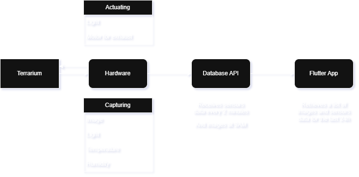
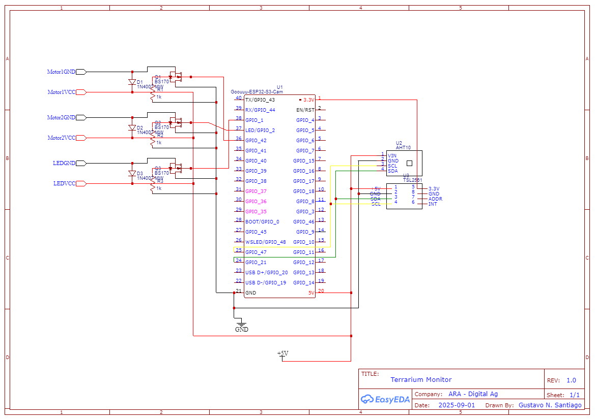
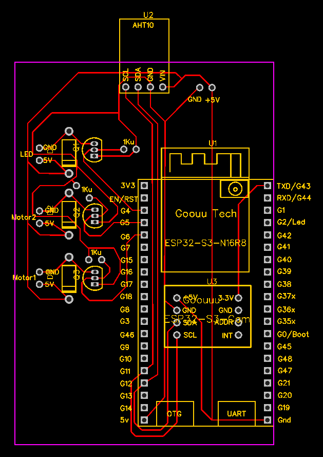
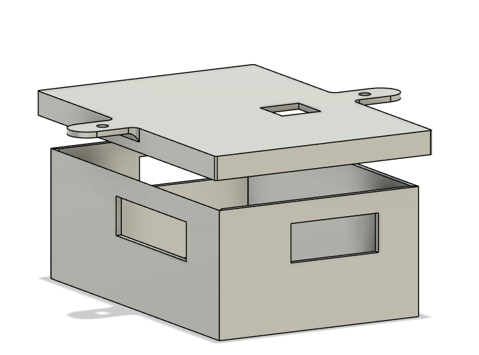
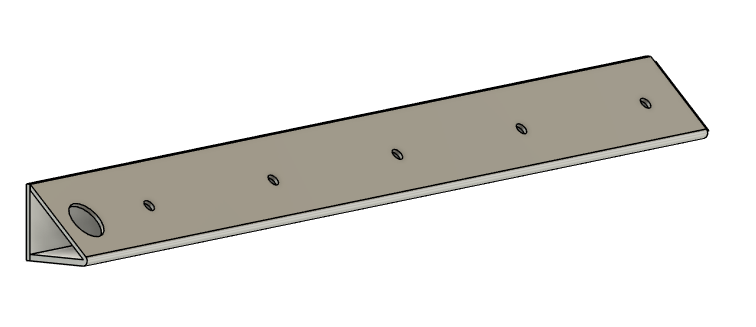

**<center>Terrarium Monitor</center>**

>An integration of ESP32-CAM, Firebase and Flutter to monitor my spider pet 

<hr>


**<center>Table of Contents</center>**

- [List of Materials](#list-of-materials)
  - [Terrarium](#terrarium)
  - [Hardware](#hardware)
- [Objective](#objective)
- [Workflow](#workflow)
- [ESP32](#esp32)
- [Firebase](#firebase)
- [App](#app)
- [PCB](#pcb)
- [3D Files](#3d-files)

# List of Materials

## Terrarium

- [X] Hinged Acrylic Box with holes for cross-ventilation
- [X] Expanded Foam
- [X] Glue for foam
- [X] Tree Bark
- [X] Black paper
- [X] Transparent Tape
- [X] Branches
- [X] Sand
- [X] Moss

## Hardware

- [X] ESP32-CAM
- [X] Light Sensor
- [X] White LEDs
- [X] AHT10 temperature and humidity sensor
- [X] Resistors
- [X] Diodes
- [X] Transistors
- [X] Cable and charger for powering
- [X] PCB
- [X] Exhausting Fan
- [X] 3D-printed case for the circuit
- [X] 3D-printed structure for the White LEDs "strip"
- [X] Wires
- [X] JWT Connectors

# Objective

Build an insect terrarium with image and sensor-based data monitoring and environment automation. The image and sensor-based data is sent to the cloud and retrieved to a mobile app. The sensor-based data is used to turn on exhausting fans and LEDs.


# Workflow

The workflow works as depicted in the picture bellow.



The ESP32 captures temperature, air humidity, light and takes images every 2 minutes. If the temperature or humidity is higher than the set threshold, the exhausting fans are turned on. If the light is below the set threshold, the LEDs are turned on. After this, the image is captured and all data is sent to Google Firebase.

Google Firebase stores the images as files and the sensor-based data in a regular database. To not acumulate too much data, everything is deleted every 48 hours.

A Flutter-based app retrieves the images and sensor-based data and displays it in the screen in form of image and graphs.

# ESP32

The final code for the ESP32-CAM is in this [folder](ESP32/terrariumMonitor/). I split the actuators and sensors to make it more organized. All the sensitive information is on secrets.h (which I obviously did not push to Git) The pseudo-code for the ESP32 working is as below:

``` bash

DEFINE feature flags (user auth, storage, filesystem, database)
INCLUDE required libraries and headers

DEFINE camera pin assignments

CREATE Firebase and WiFi objects

SETUP timing variables for periodic data sending

DECLARE variables for sensor readings

DECLARE function prototypes

SETUP file system objects and file operation callback

FUNCTION file_operation_callback(file, filename, mode):
    SWITCH mode:
        CASE read: open file for reading
        CASE write: open file for writing
        CASE append: open file for appending
        CASE remove: delete file
    ASSIGN opened file to global variable

FUNCTION setup():
    Start serial communication
    Print startup message
    Initialize WiFi
    Configure time via NTP
    Initialize camera
    Print camera initialized message
    Initialize LittleFS
    Format LittleFS (delete all files)
    Initialize sensors
    Initialize actuators (set pin modes and initial states)
    Configure Firebase SSL client
    Initialize Firebase app, database, and storage
    Print setup complete

FUNCTION loop():
    Run Firebase app loop
    IF app is ready AND 2 minutes have passed:
        Delete previous image file if it exists
        Read sensors (lux, temp, humidity)
        Print sensor values
        Control actuators based on sensor values
        Update last data send time
        Print sending data message
        Get current time
        Send sensor data to Firebase Realtime Database
        Capture photo and save to LittleFS
        Update media_file to point to new photo
        Print uploading file message
        Upload photo to Firebase Storage

FUNCTION capturePhotoSaveLittleFS(photoPath):
    Flush camera buffer
    Capture photo
    IF capture failed: print error and return
    Print photo file name
    Ensure parent directory exists (create if needed)
    Open file for writing
    IF file open failed: print error and return
    Write photo data to file, flush, and close
    Print file saved message
    Verify file exists and size matches
    IF verification passed: update media_file and print message
    ELSE: print warning

FUNCTION initLittleFS():
    Mount LittleFS, restart if failed

FUNCTION initWiFi():
    Connect to WiFi, print status and IP

FUNCTION initCamera():
    Configure camera settings and pins
    Initialize camera, restart if failed
    Set camera sensor parameters
    Print camera initialized message

FUNCTION processData(aResult):
    IF not a result: return
    IF event: print event info
    IF debug: print debug info
    IF error: print error info
    IF download progress: print download progress
    IF upload progress: print upload progress and download URL if complete

```

# Firebase

In the Google Firebase project set for this:

* The sensor-based data is stored in a Realtime Database, under a collection. Under this collection, it has another sub-collections: humidity, luminosity and temperature. Each one of them stores it respective data. The doc name is related to the data collection's timestamp.
* The images are stored in a Storage environment under a folder. Each image is named based on the data collection timestamp.
* There is a function that activates every 48h, at 6 a.m. that deletes every data and image in the project.

# App

The App was made using Flutter and deployed locally. It retrieves the all the readings and image links. The last image and data is shown in the screen. All the data is used to plot line graphs. The 8 last images are shown in the screen. If the user wants to see more, he clicks in "See More" and 8 more will appear.


When clicking on past images, the image will pop-up and be shown bigger in the screen, with the Date and Time, and data measured by the same time.


# PCB

Under the [PCB](PCB) folder, you can find the schematics, gerber file and PCB layout for the PCB. I used a simple circuit with transistor, diode and resistor to activate and deactivate the LED and exhausting fans.





# 3D Files

Under the [3D Files](3DFiles) folder, you can find all the necessary files to print the case for the PCB and the LEDs/AHT10 sensor encasing.

**PCB Case:**



**Sensors Case:**


